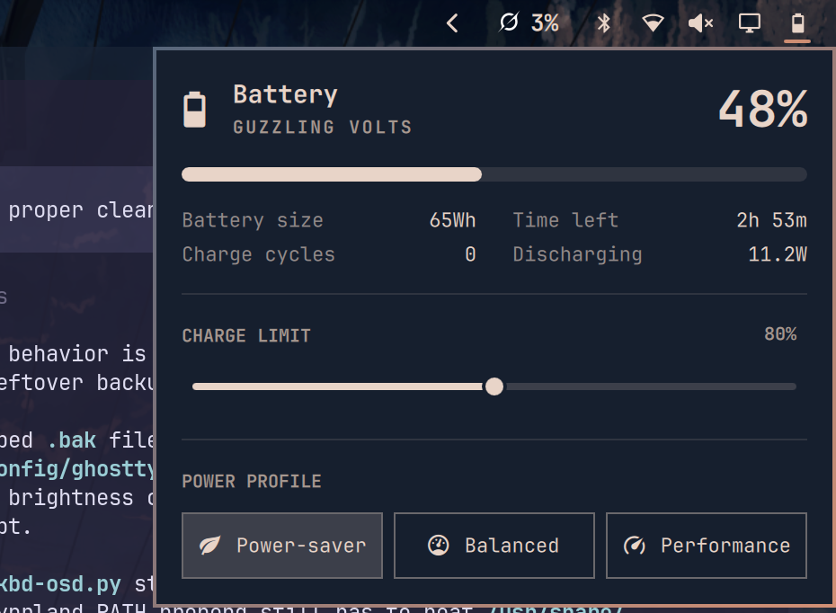
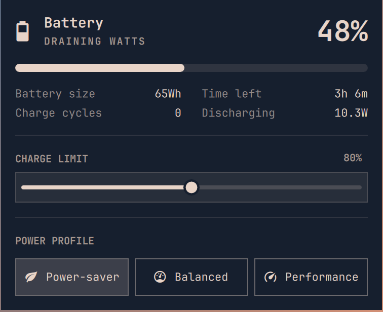

# Charge Cap

Charge Cap replaces the Omarchy battery widget with the same popover plus a CHARGE LIMIT slider. The slider writes the kernel charge end threshold.





## Install

If another clone of `omarchy.power` is already on the bar, such as `zeusveilmon.power`, disable or remove it first. Enable only replaces `omarchy.power` in place.

```sh
omarchy plugin add https://github.com/JustNak/Charge-Cap.git --enable
```

Click the battery button. CHARGE LIMIT sits above POWER PROFILE. Drag the slider and release to apply. Escape closes the popover.

## Hardware

The slider is shown when the kernel exposes `/sys/class/power_supply/BAT*/charge_control_end_threshold` and Charge Cap can write it. Time to full is until that limit, not 100%.

Write order:

1. `asusctl battery limit N` when `/usr/bin/asusctl` exists. No password prompt. ASUS machines with asusd take this path.
2. A direct write to the sysfs node when the node is user-writable.
3. `pkexec /bin/sh` writing that same node. Omarchy's polkit agent prompts once per change. ThinkPad, Framework, Dell, and other machines that only allow root to write the node take this path.

There is no slider when the kernel node is missing. Persistence is the kernel driver, not a file in this plugin. The control range is 60 to 100 percent.

## Charge cycles

A firmware `cycle_count` above 0 is shown as an integer. A `cycle_count` of `0`, or a missing `cycle_count` file, means the firmware did not report a counter. Charge Cap then estimates equivalent cycles as percentage points discharged, divided by 100.

The estimate is stored at `$XDG_STATE_HOME/omarchy/justnak.charge-cap/cycles.json`, or `~/.local/state/omarchy/justnak.charge-cap/cycles.json` when `XDG_STATE_HOME` is unset.

Dips while UPower reports the pack charging or holding at the charge limit are not counted. The system battery is the first `type=Battery` supply that is not `scope=Device`.

## Remove

```sh
omarchy plugin remove justnak.charge-cap --yes
```

Removal puts `omarchy.power` back in the same bar slot.

## Check

```sh
omarchy plugin validate .
node test/model.js
```
